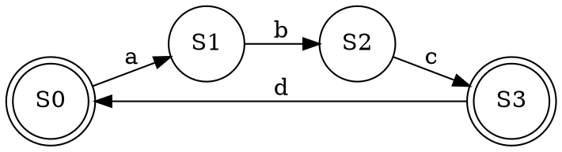

# 2048 for SystemVerilog

This is a SystemVerilog implementation of the game 2048.

```graphviz
digraph estados {
    rankdir=LR;
    node [shape=doublecircle]; S0 S3;
    node [shape=circle];

    S0 -> S1 [label="a"];
    S1 -> S2 [label="b"];
    S2 -> S3 [label="c"];
    S3 -> S0 [label="d"];
}
```